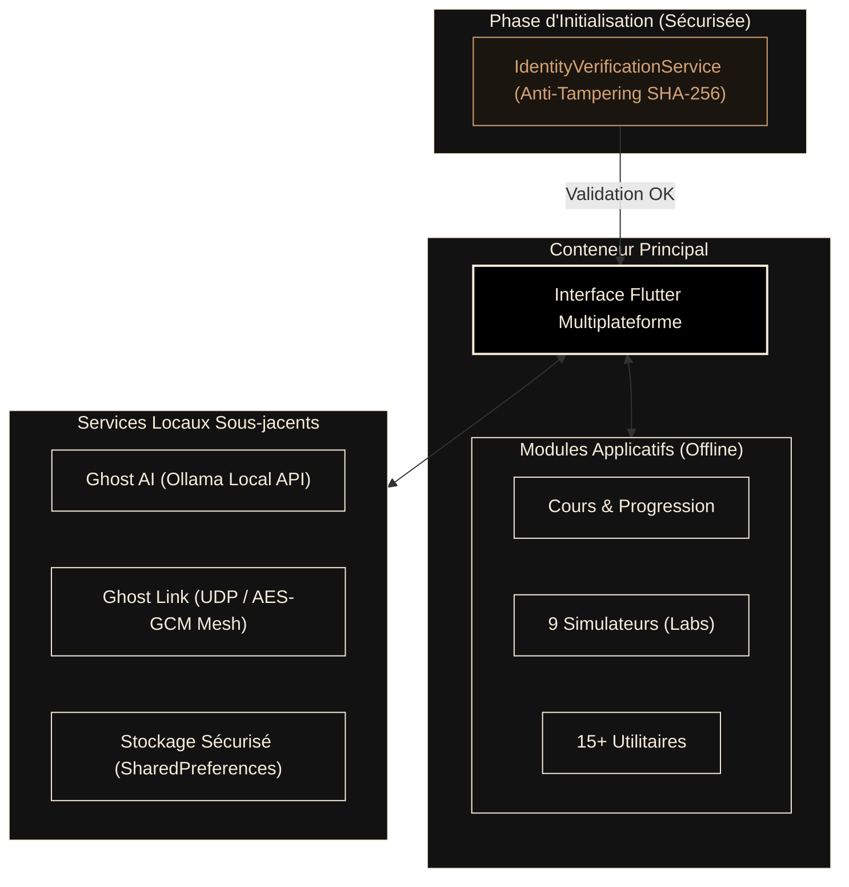

<div align="center">
  

  # T2DECODE
  
  **« Le savoir ne devrait pas toujours dépendre d'une connexion. »**<br>
  — *Maxime MARTIN CIVET*

  <br>

  <!-- CI & Distribution Badges -->
  [](https://github.com/TUTODECODE-FR/T2DECODE/actions/workflows/ci.yml)
  [](https://github.com/TUTODECODE-FR/T2DECODE/releases/latest)
  [](https://apps.apple.com/us/app/t2decode-plateforme/id6762523276?mt=12)
  [](https://flutter.dev)
  [](https://github.com/TUTODECODE-FR/T2DECODE/blob/main/LICENSE)
  
  <br>

  <!-- Security & Trust Badges -->
  [](https://www.bestpractices.dev/projects/12999)
  [](https://www.bestpractices.dev/projects/12999)
  [](https://scorecard.dev/viewer/?uri=github.com/TUTODECODE-FR/T2DECODE)
  [](https://snyk.io/test/github/TUTODECODE-FR/T2DECODE)
  [](https://sonarcloud.io/summary/new_code?id=TUTODECODE-FR_T2DECODE)
  [](https://sonarcloud.io/summary/new_code?id=TUTODECODE-FR_T2DECODE)

  <br>
  <p>
    <b>Plateforme locale d’apprentissage technique (Réseau · Systèmes · Sécurité Défensive) avec boîte à outils et IA intégrée.</b><br>
    <i>100% Offline-first · Air-gapped ready · Zéro télémétrie · IA & RAG locaux (Ollama) · P2P LAN Mesh</i>
  </p>
  <br>

  [Releases](https://github.com/TUTODECODE-FR/T2DECODE/releases/latest) · [Build & Compilation](docs/build.md) · [Architecture Souveraine](docs/architecture.md) · [Confidentialité & RGPD](RGPD.md) · [Contribuer](CONTRIBUTING.md)
</div>


## 🎯 La Vision T2DECODE

T2DECODE est une **suite pédagogique et technique de classe entreprise** conçue pour apprendre, expérimenter et diagnostiquer des infrastructures **sans aucune dépendance au cloud ni connexion Internet**.

Que vous soyez dans un *datacenter* sécurisé, dans un train sans réseau, ou dans un environnement *air-gapped* strict, T2DECODE vous offre vos outils, vos cours et votre IA.

- 📚 **Apprentissage Structuré** : Cours interactifs en Markdown avec QCM de validation et système de progression gamifié (XP & Badges).
- 🛠️ **Boîte à Outils Professionnelle** : Plus de 15 utilitaires de calcul, diagnostic et conversion (Syslog, CIDR, Chmod, Base64).
- 🔬 **Laboratoires Virtuels (Simulateurs)** : Entraînez-vous sur des simulateurs de réseaux (NetKit), cryptographie, systèmes et algorithmique.
- 🛡️ **Souveraineté & Résilience** : Conçu spécifiquement pour opérer en environnements stricts (Air-gapped, Zéro Confiance).


## 🛡️ Posture de Sécurité & Audits Continus

La sécurité n'est pas une option, c'est le cœur de T2DECODE. Nous appliquons les standards de développement les plus stricts du marché pour garantir une fiabilité absolue.

| Métrique de Confiance | Implémentation | Preuve |
| :--- | :--- | :--- |
| **Analyse Statique (SAST)** | Vérification en continu par **SonarQube** et **CodeQL** à chaque modification. | [](https://sonarcloud.io/summary/new_code?id=TUTODECODE-FR_T2DECODE) |
| **Sécurité des Dépendances** | Audit automatisé de la chaîne logistique logicielle par **Snyk**. | [](https://snyk.io/test/github/TUTODECODE-FR/T2DECODE) |
| **Pratiques de Développement** | Respect des critères de l'Open Source Security Foundation (OpenSSF). | [](https://scorecard.dev/viewer/?uri=github.com/TUTODECODE-FR/T2DECODE) |
| **Anti-Tampering** | Vérification d'intégrité SHA-256 des assets au démarrage de l'application. | `IdentityVerificationService` |
| **Zéro Télémétrie** | Aucun appel API sortant (air-gapped par conception). RGPD strict. | [Politique Privacy](RGPD.md) |


## ⚡ Fonctionnalités Phares

| Module | Description | Guide |
| :--- | :--- | :--- |
| 🧠 **Ghost AI (IA Locale)** | Tuteur conversationnel en streaming connecté à Ollama (127.0.0.1). Interrogez vos cours localement. | [docs/ollama.md](docs/ollama.md) |
| 🔗 **Ghost Link (LAN P2P)** | Découverte automatique de pairs via UDP et chat chiffré en réseau local (sans serveur central). | [docs/architecture.md](docs/architecture.md) |
| 🔬 **Laboratoires Intégrés** | 9 simulateurs interactifs : Réseau (NetKit), Système, Cloud, Cryptographie, Linux, et CTF. | [docs/labs.md](docs/labs.md) |
| 🛠️ **Multi-Outils Offline** | Calculateur CIDR, Permissions Chmod, Générateur CRON, JSON Formatter, Encodeurs Hash/Base64. | [docs/tools.md](docs/tools.md) |


## 📥 Téléchargements & Plateformes (v1.0.2)

➡️ [**Télécharger les binaires précompilés (Releases GitHub)**](https://github.com/TUTODECODE-FR/T2DECODE/releases/latest)

| Plateforme | Format de Distribution | Statut CI | Accessibilité |
| :--- | :--- | :---: | :---: |
|  | **APK** / AAB (64-bit) | ✅ Actif | Disponible |
|  | **ZIP** / Installateur EXE | ✅ Actif | Disponible |
|  | **[App Store](https://apps.apple.com/us/app/t2decode-plateforme/id6762523276?mt=12)** / PKG / ZIP | ✅ Actif | Disponible |
|  | **AppImage** / DEB (64-bit) | ✅ Actif | Disponible |

> 🔒 **Garantie d'intégrité** : Chaque version publiée s'accompagne d'un fichier de vérification `SHA256SUMS.txt` et de signatures GPG pour authentifier la provenance des binaires.


## 🖼️ Interface Premium (Noir & Beige)

L'interface de T2DECODE est conçue selon un design moderne (*Glassmorphism*, animations fluides) pour offrir une expérience utilisateur d'excellence sur toutes les tailles d'écran.

<div align="center">
  
  <br><br>
</div>

<table width="100%" style="border: none; border-collapse: collapse;">
  <tr>
    <td colspan="2" align="center"><b>Vue Bureau — Accueil & Tableau de Bord</b><br></td>
  </tr>
  <tr>
    <td width="50%" align="center"><b>Navigation Parcours</b><br></td>
    <td width="50%" align="center"><b>Boîte à Outils Utilitaires</b><br></td>
  </tr>
  <tr>
    <td width="50%" align="center"><b>Fiches Réflexes (Cheat Sheets)</b><br></td>
    <td width="50%" align="center"><b>Ghost AI (Tuteur IA Local)</b><br></td>
  </tr>
  <tr>
    <td width="50%" align="center"><b>Ghost Link (LAN P2P Chat)</b><br></td>
    <td width="50%" align="center"><b>Paramètres & Souveraineté</b><br></td>
  </tr>
</table>


## ⚙️ Architecture Interne

T2DECODE suit le principe de l'isolation des processus et des données privatives.




## 👨‍💻 Compilation & Développement

### 1. Prérequis Système
- **Linux** : `sudo apt-get install clang cmake git ninja-build pkg-config libgtk-3-dev`
- **macOS** : `xcode-select --install`
- **Windows** : Git et Visual Studio 2022 (C++ Desktop).

### 2. Lancement Rapide
```bash
git clone https://github.com/TUTODECODE-FR/T2DECODE.git
cd T2DECODE

# Validation de l'environnement (Flutter, Dart, Ollama)
make setup

# Téléchargement des packages
make get

# Exécution des tests unitaires
make test

# Lancement en mode debug
flutter run
```


## 🏛️ Mentions Légales & Association

Le projet T2DECODE est soutenu par l'**Association TUTODECODE** (Loi 1901, ESS).
Notre mission : démocratiser les infrastructures et la cybersécurité avec des outils souverains, sans tracking.

- **Éditeur** : Association TUTO DECODE (SIREN : 102 763 133)
- **Directeur de Publication** : Maxime MARTIN CIVET
- **Preuve Légale** : [Annonce de création au JOAFE](https://www.journal-officiel.gouv.fr/pages/associations-detail-annonce/?q.id=id:202600110336)
- **Confidentialité** : [Politique RGPD Zéro-Data](RGPD.md)


## 🤝 Contribuer

T2DECODE est un bien commun open source. Rejoignez-nous !
- ⭐ **Étoilez** ce dépôt pour nous soutenir.
- 🐛 **Signalez des bugs** via les *Issues*.
- 📝 **Ajoutez des cours** en Markdown.
- 👨‍💻 **Codez de nouveaux outils** en suivant le [Guide de Contribution (CONTRIBUTING.md)](CONTRIBUTING.md).

> 💖 **Soutenir le projet** : [Faire un don sécurisé via HelloAsso](https://www.helloasso.com/associations/tutodecode) pour nous aider à payer nos serveurs vitrines.

<br>
<div align="center">
  <i>Distribué sous licence <b>GNU General Public License v3.0 (GPLv3)</b>.</i>
</div>
