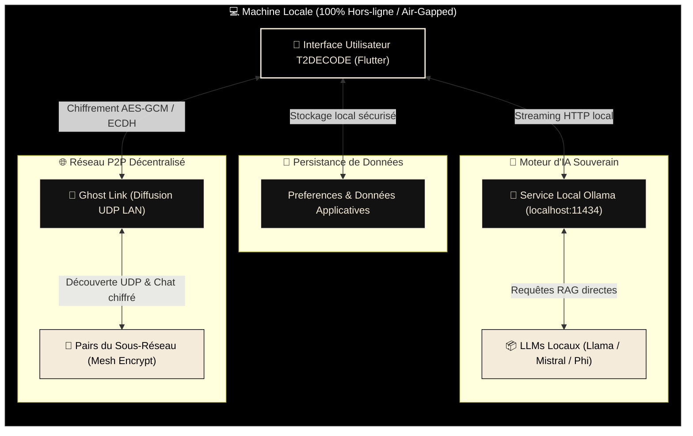

<div align="center">
  

  # T2DECODE
  
  **« Le savoir ne devrait pas toujours dépendre d'une connexion. »**<br>
  — *Maxime MARTIN CIVET*

  [](https://github.com/TUTODECODE-FR/T2DECODE/actions/workflows/ci.yml)
  [](https://github.com/TUTODECODE-FR/T2DECODE/releases/latest)
  [](https://apps.apple.com/us/app/t2decode-plateforme/id6762523276?mt=12)
  [](https://github.com/TUTODECODE-FR/T2DECODE/blob/main/LICENSE)
  [](https://flutter.dev)
  [](https://ollama.com/)
  [](RGPD.md)
  
  <br>
  <p>
    <b>Plateforme locale d’apprentissage technique (Réseau · Systèmes · Sécurité Défensive) avec boîte à outils et IA intégrée.</b><br>
    <i>100% Offline-first · Air-gapped ready · Zéro télémétrie · IA & RAG locaux (Ollama) · P2P LAN Mesh</i>
  </p>
  <br>

  [Releases](https://github.com/TUTODECODE-FR/T2DECODE/releases/latest) · [Build & Compilation](docs/build.md) · [Architecture Souveraine](docs/architecture.md) · [Confidentialité & RGPD](RGPD.md) · [Contribuer](CONTRIBUTING.md)
</div>


## 🎯 Raison d'Être de T2DECODE

T2DECODE est une **suite pédagogique et technique souveraine** conçue pour apprendre, expérimenter et diagnostiquer des infrastructures **sans aucune dépendance au cloud ni connexion Internet** :

- 📚 **Apprentissage Structuré** : Cours interactifs en Markdown/JSON avec QCM de validation des acquis et système de progression gamifié (XP & Badges).
- 🛠️ **Boîte à Outils Professionnelle** : Plus de 15 utilitaires de calcul, diagnostic et conversion fonctionnant entièrement en local.
- 🔬 **Laboratoires Virtuels (Simulateurs)** : Simulateurs interactifs de réseaux (NetKit), cryptographie, systèmes, cloud et algorithmique.
- 🛡️ **Souveraineté & Résilience** : Conçu spécifiquement pour opérer en environnements stricts (*air-gapped*, zones blanches, datacenters sécurisés).


## 🛡️ Engagements & Architecture (Privacy by Design)

T2DECODE adopte un modèle de sécurité rigoureux, axé sur la souveraineté numérique et le respect absolu de l'utilisateur final.



### Les 4 Piliers de l'Architecture Locale

1. ⚡ **100% Air-Gapped Ready** : Aucune connexion Internet requise après l'installation. L'application et tous ses modules sont autonomes.
2. 🧠 **IA & RAG Locaux (Ollama)** : Connecteur intégré de streaming HTTP vers votre instance locale Ollama. Accédez à un tuteur LLM privatif capable d'interroger directement vos cours (RAG).
3. 🌐 **Réseau LAN P2P (Ghost Link)** : Module de communication par diffusion UDP sur réseau local. Messagerie instantanée décentralisée et chiffrée de bout en bout entre pairs d'un même sous-réseau.
4. 🚫 **Zéro Télémétrie & Zéro Tracking** : Aucun appel réseau externe, aucun pistage (*analytics*), aucune collecte de données. L'intégrité de vos données est totale ([Politique RGPD](RGPD.md)).

### Modèle de Confiance
| Ce que nous faisons ✅ | Ce que nous ne faisons PAS ❌ |
| :--- | :--- |
| **Exécution 100% Locale** avec vérification d'intégrité SHA-256 des assets | **Pas d’API externe ni de cloud obligatoire** |
| **Isolation complète** et respect strict du [RGPD](RGPD.md) | **Pas d’analytics ni de cookies de pistage** |
| **Transparence totale** via des binaires open source et auditables | **Pas d’envoi de données de télémétrie vers des tiers** |


## 👥 À Qui S'Adresse T2DECODE ?

- 🎓 **Étudiants & Autodidactes IT** : Acquisition de compétences solides en réseaux, administration Linux et sécurité défensive.
- 🧑‍💻 **Administrateurs Système & Réseau** : Utilitaires de diagnostic rapides (calculateurs IP, permissions chmod, générateurs CRON, tables de ports) utilisables sans accès réseau.
- 🕵️ **Auditeurs & Experts en Sécurité** : Interventions fiables et sécurisées dans des environnements isolés ou à diffusion restreinte (*datacenters*, salles blanches).
- 👨‍🏫 **Enseignants & Formateurs** : Plateforme pédagogique locale, reproductible et personnalisable grâce à l'importation de modules Markdown externes.


## ⚡ Fonctionnalités Phares

| Fonctionnalité | Description | Documentation |
| :--- | :--- | :--- |
| 🧠 **Ghost AI (IA Locale)** | Tuteur conversationnel en streaming connecté à Ollama. Compatible Phi-3, Llama 3.2, Mistral, Qwen, CodeLlama. | [docs/ollama.md](docs/ollama.md) |
| 🔗 **Ghost Link (LAN P2P)** | Découverte automatique de pairs via UDP et chat chiffré en réseau local de bout en bout sans serveur central. | [docs/architecture.md](docs/architecture.md) |
| 🔬 **Laboratoires Intégrés** | 9 simulateurs interactifs : Réseau (NetKit), Système, Cloud, Cryptographie, Linux, Algorithmes et Préparation CTF. | [docs/labs.md](docs/labs.md) |
| 🛠️ **Multi-Outils Offline** | 15+ outils de productivité : Hash (SHA/MD5), CIDR IPv4/v6, Chmod, CRON, JSON Formatter, Base64, ASCII, Syslog, etc. | [docs/tools.md](docs/tools.md) |
| 🔒 **Sécurité au Démarrage** | Vérification automatique des sommes de contrôle SHA-256 (`assets/asset_checksums.json`) et protection anti-tampering. | [docs/security-model.md](docs/security-model.md) |


## 📥 Téléchargements & Plateformes (v1.0.2)

➡️ [**Télécharger les binaires précompilés (Releases GitHub)**](https://github.com/TUTODECODE-FR/T2DECODE/releases/latest)

| Plateforme | Format de Distribution | Statut CI | Accessibilité |
| :--- | :--- | :---: | :---: |
|  | **APK** / AAB (64-bit) | Actif | Disponible (v1.0.2) |
|  | **ZIP** / Installateur EXE | Actif | Disponible (v1.0.2) |
|  | **[App Store](https://apps.apple.com/us/app/t2decode-plateforme/id6762523276?mt=12)** / PKG / ZIP Universel | Actif | Disponible (v1.0.2) |
|  | **AppImage** / DEB (64-bit) | Actif | Disponible (v1.0.2) |

> 🔒 **Garantie d'intégrité** : Chaque version publiée s'accompagne d'un fichier de vérification `SHA256SUMS.txt` et de signatures cryptographiques pour authentifier la provenance des binaires.


## 🖼️ Aperçu de l'Interface Premium (Noir & Beige)

L'interface de T2DECODE est conçue selon un design moderne (*Noir & Beige*, *Glassmorphism*, animations fluides) pour offrir une expérience de navigation d'excellence sur toutes les tailles d'écran.

<table width="100%" style="border: none; border-collapse: collapse;">
  <tr>
    <td colspan="2" align="center"><b>Vue Bureau — Accueil & Tableau de Bord</b><br></td>
  </tr>
  <tr>
    <td width="50%" align="center"><b>Navigation Parcours</b><br></td>
    <td width="50%" align="center"><b>Boîte à Outils Utilitaires</b><br></td>
  </tr>
  <tr>
    <td width="50%" align="center"><b>Fiches Réflexes (Cheat Sheets)</b><br></td>
    <td width="50%" align="center"><b>Ghost AI (Tuteur IA Local)</b><br></td>
  </tr>
  <tr>
    <td width="50%" align="center"><b>Ghost Link (LAN P2P Chat)</b><br></td>
    <td width="50%" align="center"><b>Paramètres & Souveraineté</b><br></td>
  </tr>
</table>


## 👨‍💻 Environnement de Développement & Compilation

### 1. Dépendances Système Nécessaires

L'application reposant sur Flutter et des librairies natives (notamment pour le réseau et les fenêtres de bureau), assurez-vous d'installer les prérequis selon votre système d'exploitation :

- **Linux (Debian / Ubuntu)** :
  ```bash
  sudo apt-get update && sudo apt-get install -y clang cmake git ninja-build pkg-config libgtk-3-dev liblzma-dev libstdc++-12-dev
  ```
- **macOS** : `xcode-select --install`
- **Windows** : Git et Visual Studio 2022 avec la charge de travail *Développement Desktop en C++*.

> 📖 *Pour des instructions détaillées par distribution, consultez [OS_DEPENDENCIES.md](OS_DEPENDENCIES.md).*

### 2. Démarrage Rapide

```bash
# Clonage du dépôt officiel
git clone https://github.com/TUTODECODE-FR/T2DECODE.git
cd T2DECODE

# Vérification de l'environnement de build
make setup

# Installation des dépendances Flutter
make get

# Exécution de la suite de tests unitaires
make test

# Lancement de l'application en mode débogage
flutter run
```

### 🛠️ Automatisation des Tâches (Makefile)

Le projet intègre un `Makefile` complet pour faciliter la compilation sur l'ensemble des cibles :

```bash
make setup          # Diagnostic des dépendances (Flutter, Dart, Ollama)
make clean          # Nettoyage complet des répertoires de build
make test           # Lancement des tests automatisés
make build-android  # Construction de l'archive APK release
make build-macos    # Construction du binaire .app macOS
make build-dmg      # Création de l'image disque d'installation .dmg (macOS)
make build-linux    # Construction de l'exécutable natif Linux
```


## 🏛️ L'Association TUTODECODE (Mentions Légales)

Le projet T2DECODE est développé et soutenu par l'**Association TUTODECODE**, structure relevant de l'Économie Sociale et Solidaire (ESS).  
Notre mission est de démocratiser la maîtrise des infrastructures informatiques et de la cybersécurité défensive en fournissant des outils souverains, auditable et respectueux de la vie privée.

Dans une démarche absolue de transparence et de rigueur, l'association publie ses identifiants légaux officiels :

- **Éditeur** : Association Loi 1901 TUTO DECODE
- **Directeur de Publication** : Maxime MARTIN CIVET
- **SIREN** : 102 763 133
- **Site Web Officiel** : [https://tutodecode.org](https://tutodecode.org)
- **Preuve Légale** : [Annonce de création parue au Journal Officiel de la République Française (JOAFE)](https://www.journal-officiel.gouv.fr/pages/associations-detail-annonce/?q.id=id:202600110336)
- **Engagement de Confidentialité** : [Consulter notre Politique RGPD](RGPD.md)

> 💡 *L'intégralité de ces mentions légales et attestations est accessible directement depuis l'application via la section **Paramètres > Mentions Légales (JO)***.


## 🤝 Contribuer au Projet

T2DECODE est un bien commun open source construit par et pour sa communauté. Toutes les contributions sont chaleureusement accueillies !

Consultez notre guide de contribution [CONTRIBUTING.md](CONTRIBUTING.md) pour découvrir comment :
- ⭐ **Soutenir le dépôt** en lui attribuant une étoile sur GitHub.
- 🐛 **Signaler des anomalies** ou suggérer des fonctionnalités via les *Issues*.
- 📝 **Créer ou enrichir des cours** (rédaction au format Markdown / QCM en JSON).
- 💻 **Développer de nouveaux outils** utilitaires en Dart/Flutter.

### 💖 Soutien Financier (Dons)
Si T2DECODE vous fait gagner du temps ou enrichit votre parcours professionnel, vous pouvez soutenir l'association TUTODECODE. Les dons servent exclusivement à pérenniser l'hébergement de nos services, le maintien des noms de domaine et la continuité de nos actions éducatives gratuites et sans publicité.
- ➡️ **[Faire un don sécurisé à l'association via HelloAsso](https://www.helloasso.com/associations/tutodecode)**


## 📄 Licence & Droits

Ce projet est distribué sous licence **[GNU General Public License v3.0 (GPLv3)](LICENSE)**.  
Un immense merci à tous les testeurs, développeurs, techniciens et passionnés qui participent à faire vivre ce projet ! 🌟
