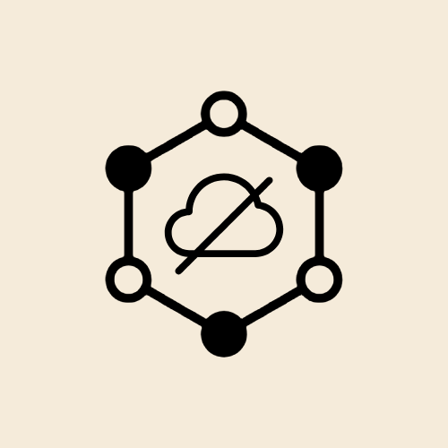

<p align="center">
  
</p>

# TUTODECODE

[](https://github.com/TUTODECODE-FR/TUTODECODE/actions/workflows/ci.yml)
[](https://github.com/TUTODECODE-FR/TUTODECODE/releases/latest)
[](https://github.com/TUTODECODE-FR/TUTODECODE/blob/main/LICENSE)
[](https://flutter.dev)

Plateforme locale d'apprentissage technique et boîte à outils cybersécurité.  
**Air‑gapped ready · Zéro tracking · IA locale (Ollama)**

[Releases](https://github.com/TUTODECODE-FR/TUTODECODE/releases/latest) · [Build](docs/build.md) · [Architecture](docs/architecture.md) · [Confidentialité](docs/privacy.md) · [Contribution](CONTRIBUTING.md)

> **"Le savoir technique ne devrait jamais dépendre d'une connexion."**

TUTODECODE est une application Flutter multi-plateforme conçue pour l’apprentissage technique et l’expérimentation cybersécurité en environnement local, y compris hors connexion.

---

## ✅ État actuel du projet

### Disponible

- Application Flutter multi-plateforme
- Exécution locale sans cloud
- Intégration Ollama locale
- Modules de contenu Markdown/JSON
- Outils offline intégrés

### En développement

- Import/export avancé des modules
- Synchronisation de contenus signés
- Distribution communautaire offline-first

## 🧭 Plateformes (CI / tests / distribution)

| Plateforme | CI | Test manuel | Distribution |
| :--- | :---: | :---: | :---: |
| Android | Partiel | Validé | Disponible (v1.0.1) |
| Windows | Partiel | Validé | Disponible (v1.0.1) |
| macOS | Configuré | Validé | Disponible (v1.0.1) |
| Linux | Partiel | Validé | Disponible (v1.0.1) |
| Web | Non activé | Non validé | Non disponible |
| iOS | Non activé | Non validé | Non disponible |

> Les statuts sont mis à jour à chaque release. Si un artefact manque, il n'est pas marqué ✅.

---

## 📥 Téléchargements

Les binaires sont publiés sur la page des releases GitHub :

➡️ [Télécharger la dernière version](https://github.com/TUTODECODE-FR/TUTODECODE/releases/latest)

| Plateforme | Fichier recommandé | Alternatives | Notes |
| :--- | :--- | :--- | :--- |
|  | **APK** | AAB | Disponible (v1.0.1) |
|  | **EXE** | ZIP | Disponible (v1.0.1) |
|  | **PKG** | ZIP | Disponible (v1.0.1) |
|  | **AppImage** | DEB, TAR.GZ | Disponible (v1.0.1) |

### Vérification d'intégrité

Un fichier `SHA256SUMS.txt` est publié dans chaque release pour vérifier l'intégrité des binaires.

---

## ⚡ Aperçu

| Domaine | Résumé |
| :--- | :--- |
| IA locale | Intégration Ollama sans service tiers ([docs/ollama.md](docs/ollama.md)) |
| Laboratoires | Simulations documentées dans [docs/labs.md](docs/labs.md) |
| Outils | Boîte à outils offline documentée dans [docs/tools.md](docs/tools.md) |
| Modules | Support de contenus Markdown/JSON ([docs/modules.md](docs/modules.md)) |
| Sécurité | Fonctionnement local et modèle documenté ([docs/security-model.md](docs/security-model.md)) |

---

## ⚡ Pourquoi TUTODECODE ?

* **🛡️ Souveraineté Totale** : Aucune dépendance à des services tiers ou au Cloud. Tout est stocké et exécuté localement.
* **📂 Système de Modules** : Importez vos propres cours au format Markdown/JSON en les glissant dans le dossier `modules`.
* **🎨 Interface Moderne** : Une expérience fluide développée avec **Flutter**, optimisée pour la lisibilité du code.
* **📜 Mode Air-Gapped** : Idéal pour les interventions en zone sécurisée, datacenters ou zones blanches.

## 🤖 IA locale (Ollama)

Tout le traitement IA est local : aucune donnée n'est envoyée vers un service tiers.  
Guide : [docs/ollama.md](docs/ollama.md).

---

## ✨ Fonctionnalités

- [Laboratoires interactifs](docs/labs.md)
- [Outils offline](docs/tools.md)
- [Modules pédagogiques](docs/modules.md)
- [Architecture technique](docs/architecture.md)
- [Modèle de sécurité](docs/security-model.md)

---

## 🔒 Confidentialité

TUTODECODE n'envoie aucune télémétrie, aucun analytics et aucune donnée utilisateur vers un service tiers.  
Détails : [docs/privacy.md](docs/privacy.md).

---

## 👨‍💻 Développement

### Installation

```bash
git clone https://github.com/TUTODECODE-FR/TUTODECODE.git
cd TUTODECODE
make get
flutter pub get
```

### Vérification

```bash
flutter analyze
flutter test
```

### Exécution

```bash
flutter run
```

### 🔧 Commandes utiles

```bash
make setup          # Vérifie l’environnement (Flutter, Dart, Ollama)
make clean          # Nettoie les artefacts
make build-android  # Build APK release
make build-macos    # Build macOS app
make build-linux    # Build Linux binary
make build-dmg      # Création DMG (macOS)
```

---

## 📚 Documentation

- [Guide de build](docs/build.md)
- [Processus de release](docs/release.md)
- [Intégration Ollama](docs/ollama.md)
- [Architecture](docs/architecture.md)
- [Modèle de sécurité](docs/security-model.md)

---

## 🤝 Contribuer

Voir [CONTRIBUTING.md](CONTRIBUTING.md).

---

## 🖼️ Captures d’écran

À venir (documentation visuelle en cours).

---

## 🏛️ Association

Projet porté par l'**Association TUTODECODE** (ESS).  
SIREN : 102 763 133 · Site : [tutodecode.org](https://www.tutodecode.org)

---

## 🗺️ Roadmap

### v1.0.x
- Stabilisation multi-plateforme
- Finalisation des packages de distribution
- Durcissement CI/CD
- Documentation technique

### v1.1
- Gestion avancée des modules pédagogiques
- UX améliorée des laboratoires
- Catalogue d’outils offline enrichi

### v1.2
- Signatures et vérifications renforcées
- Meilleure intégration locale Ollama
- Documentation utilisateur complète

---

## 📄 Licence

GPLv3
