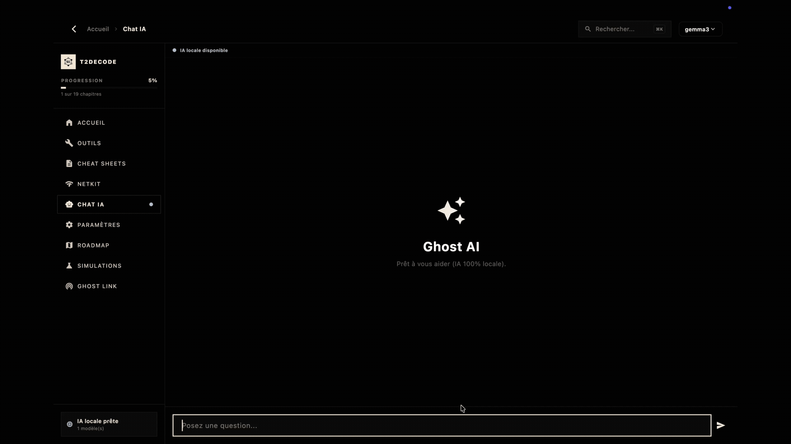

<div align="center">
  <a href="https://github.com/TUTODECODE-FR/T2DECODE">
    
  </a>

  <h1>T2DECODE</h1>
  <p><strong>T2DECODE — Plateforme pédagogique hors‑ligne pour réseaux, Linux et cybersécurité.</strong></p>

  <p>T2DECODE est une suite logicielle autonome destinée aux étudiants, formateurs et professionnels IT. Elle regroupe cours interactifs, simulateurs techniques, outils spécialisés et un assistant IA local (Ollama), conçus pour fonctionner sans connexion et garantir la confidentialité et l'intégrité des données.</p>

  <p><strong>Points forts :</strong></p>
  <ul>
    <li>Fonctionne 100% hors ligne — aucune dépendance cloud.</li>
    <li>Simulateurs interactifs : réseau, Linux, cryptographie.</li>
    <li>Outils métier intégrés : CIDR, hachage, chmod, cron.</li>
    <li>Ghost AI : assistant LLM local via Ollama, sans envoi de données externes.</li>
    <li>Intégrité et sécurité : contrôles SHA‑256 et anti‑altération au démarrage.</li>
  </ul>

  <p><strong>Multi‑plateforme • Air‑gapped ready • Open‑source (GPLv3)</strong></p>

  <br>
  
  <br><br>

  <!-- CI & Distribution Badges -->
  <p>
    <a href="https://github.com/TUTODECODE-FR/T2DECODE/actions/workflows/ci.yml"></a>
    <a href="https://github.com/TUTODECODE-FR/T2DECODE/actions/workflows/mobsf.yml"></a>
    <a href="https://github.com/TUTODECODE-FR/T2DECODE/actions/workflows/osv-scanner.yml"></a>
    <a href="https://github.com/TUTODECODE-FR/T2DECODE/releases/latest"></a>
    <a href="https://apps.apple.com/us/app/t2decode-plateforme/id6762523276?mt=12"></a>
    <a href="https://flutter.dev"></a>
    <a href="https://github.com/TUTODECODE-FR/T2DECODE/blob/main/LICENSE"></a>
  </p>

  <!-- OpenSSF Badges -->
  <p>
    <a href="https://www.bestpractices.dev/projects/12999"></a>
    <a href="https://www.bestpractices.dev/projects/12999"></a>
    <a href="https://scorecard.dev/viewer/?uri=github.com/TUTODECODE-FR/T2DECODE"></a>
  </p>

  <p>
    <a href="https://github.com/TUTODECODE-FR/T2DECODE/releases/latest">Releases</a> · 
    <a href="docs/resume.md">Résumé</a> ·
    <a href="docs/build.md">Build & Compilation</a> · 
    <a href="docs/architecture.md">Architecture</a> · 
    <a href="RGPD.md">Confidentialité</a> · 
    <a href="CONTRIBUTING.md">Contribuer</a>
  </p>
</div>


## 📊 En chiffres

- 📚 **120+** fiches pédagogiques
- 🔬 **9** simulateurs
- 🛠️ **15+** outils intégrés
- 💻 **Windows / Linux / macOS / Android**
 - 🌐 **0** dépendances cloud
- 🔒 **100%** open source


## ⚙️ Fonctionnalités

| Module | Description |
|----------|------------|
| **Ghost AI** | Assistant IA local (LLM Ollama) avec RAG sur les cours |
| **NetKit** | Simulateur réseau (Topologie, Routage, Ping) |
| **CryptoLab** | Simulateur cryptographie (Chiffrement symétrique/asymétrique) |
| **LinuxLab** | Simulateur terminal Linux |
| **CIDR** | Calculateur de sous-réseaux IPv4/IPv6 |
| **Hash** | Utilitaires de hachage (SHA256, MD5, etc.) |
| **Chmod** | Calculateur de permissions système Linux |
| **Cron** | Générateur et validateur de tâches planifiées |
| **T2C-Phantom** | Réseau P2P décentralisé de mise à jour des cours |

### 🔄 Mises à jour P2P autonomes avec T2C-Phantom

> [!NOTE]
> Le protocole **T2C-Phantom** (moteur de synchronisation P2P via proxy Go/libp2p) est actuellement répertorié dans les prochaines étapes de développement (Phase 2 de la roadmap). Le fonctionnement ci-dessous détaille la sécurité réseau et locale actuelle de l'application concernant le chargement et la mise à jour des modules.

#### 🛡️ FAQ Sécurité & Intégrité des Cours

* **Comment les mises à jour sont-elles signées ?**
  Actuellement, il n'y a pas de mécanisme de signature cryptographique asymétrique (par exemple, via un couple de clés privée/publique de l'association) pour signer les fichiers de cours à la source. Les mises à jour s'effectuent par défaut via HTTPS sur le dépôt officiel. Lors de la sauvegarde locale d'un module par le [ModuleService](file:///Users/winancher/Documents/T2DECODE/lib/core/services/module_service.dart), l'application génère un hachage SHA-256 du contenu et le stocke localement dans un fichier de contrôle de métadonnées `.module_shas.json`.

* **Comment les signatures sont-elles vérifiées ?**
  L'application effectue deux niveaux de vérification d'intégrité basés sur SHA-256 :
  1. **Assets d'origine (intégrés au build) :** Au démarrage, le système anti-altération ([AntiTamperingSystem](file:///Users/winancher/Documents/T2DECODE/lib/core/security/anti_tampering.dart)) et le service de vérification d'identité ([IdentityVerificationService](file:///Users/winancher/Documents/T2DECODE/lib/core/security/identity_verification.dart)) comparent les empreintes SHA-256 réelles des fichiers critiques (`assets/courses.json`, `assets/manifest.json`, etc.) pour s'assurer qu'ils n'ont pas été modifiés.
  2. **Modules additionnels (téléchargés ou importés) :** À chaque chargement d'un module présent dans le dossier local `TUTODECODE_Modules`, l'application recalcule son empreinte SHA-256 et la compare à celle stockée dans `.module_shas.json`. Si les empreintes diffèrent, le module est ignoré (`checksum mismatch`).

* **Peut-on injecter un faux contenu ?**
  * **Localement :** Si un fichier de cours local est altéré sur le stockage de l'appareil sans mettre à jour `.module_shas.json`, l'application le détecte et refuse de le charger.
  * **Réseau :** En l'absence de signature asymétrique, si un attaquant était en mesure de compromettre ou d'usurper le transport (ex. via une attaque Man-in-the-Middle si HTTPS est compromis, ou par empoisonnement DNS), il pourrait tenter d'injecter un faux fichier JSON de cours. Pour mitiger ce risque, l'application restreint strictement les téléchargements à l'hôte officiel `raw.githubusercontent.com` (aucun autre hôte ou sous-domaine n'est accepté). De plus, une validation de schéma stricte (`_validateModuleMap`) rejette tout fichier ne respectant pas les limites (taille maximale de 5 Mo, max 50 chapitres, max 100 Ko par chapitre, etc.) afin de prévenir les injections de code ou les débordements de mémoire.

* **Les cours téléchargés sont-ils authentifiés ?**
  Non, ils ne sont pas authentifiés au sens cryptographique (pas de certificat ou de signature de clé de l'association). L'authenticité des cours de base est garantie par la signature globale du build de l'application. Pour les modules externes additionnels, la sécurité repose uniquement sur la confiance de la connexion HTTPS vers GitHub et sur les contrôles de structure stricts appliqués à la réception.


## 🖼️ T2DECODE en Action

<p align="center">
  
  
</p>
<p align="center">
  
  
</p>


## 🎯 Pourquoi T2DECODE ?

Contrairement aux plateformes de formation classiques :

| Plateforme Cloud | T2DECODE |
|------------------|-----------|
| Internet obligatoire | Fonctionne **hors ligne** |
| Données hébergées chez un tiers | Données **locales** |
| IA distante (SaaS) | IA **locale** Ollama |
| Peu utilisable en environnement sécurisé | **Air-Gapped Ready** |
| Dépendance à un abonnement | Logiciel **autonome** |


## 👨‍💻 Cas d'Usage

**🎓 L'Étudiant**
- Réviser les concepts réseaux (OSI, TCP/IP) sans connexion Internet.
- Faire des exercices pratiques sur les simulateurs (NetKit, Linux).

**🛠️ L'Administrateur Système**
- Utiliser rapidement les calculateurs CIDR IPv4/v6.
- Vérifier des permissions Linux (chmod) ou générer des requêtes CRON depuis une interface propre.

**👨‍🏫 Le Formateur**
- Distribuer des supports de cours complets sur des clés USB (Air-gapped).
- Construire et fournir des laboratoires pédagogiques virtuels autonomes.


## 🗺️ Roadmap Visuelle

Nous construisons l'avenir de la formation souveraine :

- [x] Simulateurs interactifs
- [x] IA locale (Ollama)
- [x] Boîte à outils offline
- [ ] Moteur de synchronisation (T2C-Phantom)
- [ ] Messagerie locale P2P (Ghost Link)
- [ ] Marketplace de modules pédagogiques communautaires


## 🚀 Démarrage Rapide (Utilisateur)

Si vous ne souhaitez pas compiler l'application vous-même, voici les trois étapes pour démarrer en un éclair :

1. **📥 Télécharger** : Récupérez la [dernière release](https://github.com/TUTODECODE-FR/T2DECODE/releases/latest) correspondant à votre système (Windows, macOS, Linux, Android).
2. **⚡ Lancer** : L'application est autonome, installez-la ou exécutez le binaire directement selon votre plateforme.
3. **🎓 Utiliser** : C'est fait ! Vous pouvez instantanément utiliser la boîte à outils, jouer avec les simulateurs, et discuter avec l'IA locale (Ollama).


## 🏗️ Architecture Visuelle

T2DECODE est structuré de manière modulaire, séparant l'interface des services sous-jacents fonctionnant en local.

```text
Utilisateur
   │
   ▼
T2DECODE (Application Flutter)
 ├── 📚 Cours (Markdown, QCM, Progression locale)
 ├── 🔬 Simulateurs (Réseau, Crypto, Système)
 ├── 🛠️ Outils (Hash, CIDR, Chmod, CRON...)
 ├── 🧠 Ghost AI (Client HTTP vers Ollama local)
 └── 🔗 Ghost Link (Service P2P LAN - WIP)
```


## 📥 Téléchargements & Plateformes

➡️ [**Télécharger les binaires précompilés (Releases GitHub)**](https://github.com/TUTODECODE-FR/T2DECODE/releases/latest)

| Plateforme | Format de Distribution | Statut CI | Accessibilité |
| :--- | :--- | :---: | :---: |
|  | **APK** / AAB (64-bit) | Actif | Disponible |
|  | **ZIP** / Installateur EXE | Actif | Disponible |
|  | **[App Store](https://apps.apple.com/us/app/t2decode-plateforme/id6762523276?mt=12)** / PKG / ZIP Universel | Actif | Disponible |
|  | **AppImage** / DEB (64-bit) | Actif | Disponible |

> 🔒 **Garantie d'intégrité** : Chaque version s'accompagne d'un fichier `SHA256SUMS.txt` et de signatures cryptographiques pour authentifier la provenance des binaires.


## 🛡️ Posture de Sécurité & Audits Continus

La sécurité est au cœur de l'architecture de T2DECODE. Nous appliquons des standards de développement rigoureux pour viser un haut niveau de fiabilité.

### 1. Sécurité CI/CD (Pipelines Automatisés)
- **Analyse Statique (SAST)** : SonarQube et CodeQL s'exécutent à chaque Pull Request pour garantir la fiabilité du code.
- **Scan de Vulnérabilités** : Google OSV-Scanner audite continuellement les dépendances (`osv-scanner.yml`).
- **Pentest Automatisé** : MobSF effectue une analyse dynamique de l'APK Android généré (`mobsf.yml`).
- **OpenSSF Scorecard** : Audit continu des bonnes pratiques de sécurité Open Source.

### 2. Sécurité au Runtime (In-App)
Notre architecture est implémentée en Dart natif directement dans [`lib/core/security/`](lib/core/security/).
- **Anti-Tampering Actif** : Au démarrage, le système recalcule les empreintes SHA-256 de tous les assets via `assets/asset_checksums.json`. Toute modification malveillante est détectée.
- **Authenticité & Certificats** : Vérification stricte des signatures stockées de manière chiffrée.
- **Conception Air-Gapped** : Aucune télémétrie, aucun SDK de pistage, aucun appel API cloud.


## 👨‍💻 Environnement de Développement & Compilation

### 1. Dépendances Système Nécessaires

L'application repose sur Flutter et des librairies natives. Assurez-vous d'installer les prérequis selon votre système :

- **Linux (Debian / Ubuntu)** :
  ```bash
  sudo apt-get update && sudo apt-get install -y clang cmake git ninja-build pkg-config libgtk-3-dev liblzma-dev libstdc++-12-dev
  ```
- **macOS** : `xcode-select --install`
- **Windows** : Git et Visual Studio 2022 avec la charge de travail *Développement Desktop en C++*.

> 📖 *Pour des instructions détaillées par distribution, consultez [OS_DEPENDENCIES.md](OS_DEPENDENCIES.md).*

### 2. Démarrage Rapide

```bash
# Clonage du dépôt officiel
git clone https://github.com/TUTODECODE-FR/T2DECODE.git
cd T2DECODE

# Vérification de l'environnement de build
make setup

# Installation des dépendances Flutter
make get

# Exécution de la suite de tests unitaires
make test

# Lancement de l'application en mode débogage
flutter run
```

### 🛠️ Automatisation des Tâches (Makefile)

Le projet intègre un `Makefile` complet pour faciliter la compilation sur l'ensemble des cibles :

```bash
make setup          # Diagnostic des dépendances (Flutter, Dart, Ollama)
make clean          # Nettoyage complet des répertoires de build
make test           # Lancement des tests automatisés
make build-android  # Construction de l'archive APK release
make build-macos    # Construction du binaire .app macOS
make build-dmg      # Création de l'image disque d'installation .dmg (macOS)
make build-linux    # Construction de l'exécutable natif Linux
```


## 🏛️ L'Association TUTODECODE (Mentions Légales)

Le projet T2DECODE est développé et soutenu par l'**Association TUTODECODE**, structure relevant de l'Économie Sociale et Solidaire (ESS).  
Notre mission est de démocratiser la maîtrise des infrastructures informatiques et de la cybersécurité en fournissant des outils souverains et respectueux de la vie privée.

- **Éditeur** : Association Loi 1901 TUTODECODE
- **Directeur de Publication** : Maxime MARTIN CIVET
- **SIREN** : 102 763 133
- **Site Web Officiel** : [https://tutodecode.org](https://tutodecode.org)
- **Preuve Légale** : [Annonce de création parue au JOAFE](https://www.journal-officiel.gouv.fr/pages/associations-detail-annonce/?q.id=id:202600110336)
- **Engagement de Confidentialité** : [Consulter notre Politique RGPD](RGPD.md)


## 🤝 Contribuer & Normes Communautaires

T2DECODE est un bien commun open source construit par et pour sa communauté. Toutes les contributions sont chaleureusement accueillies !

### 📜 Standards et Santé du Projet
- 🛡️ **[Sécurité & Vulnérabilités](SECURITY.md)** : Notre politique stricte de gestion des failles.
- ⚖️ **[Licence Libre](LICENSE)** : Vos droits et obligations (GPLv3).
- 🤝 **[Code de Conduite](CODE_OF_CONDUCT.md)** : Pour un environnement sain et inclusif.
- 📖 **[Guide de Contribution](CONTRIBUTING.md)** : Comment ajouter des cours ou du code.
- 🏛️ **[Gouvernance](GOVERNANCE.md)** : Modèle de décision de l'association.
- 🆘 **[Support](SUPPORT.md)** : Où trouver de l'aide en cas de besoin.
- 🗺️ **[Roadmap](ROADMAP.md)** : Nos prochaines étapes et nos offres de missions ciblées.

### 💖 Soutien Financier (Dons)
Si T2DECODE vous fait gagner du temps ou enrichit votre parcours, vous pouvez soutenir l'association TUTODECODE. Les dons servent exclusivement à pérenniser l'hébergement de nos services.
- ➡️ **[Faire un don sécurisé via HelloAsso](https://www.helloasso.com/associations/tutodecode)**


## 🔐 Sécurité
Tous les commits de ce dépôt sont signés GPG pour en garantir l'authenticité.


## 📄 Licence & Droits
Ce projet est distribué sous licence **[GNU General Public License v3.0 (GPLv3)](LICENSE)**.
