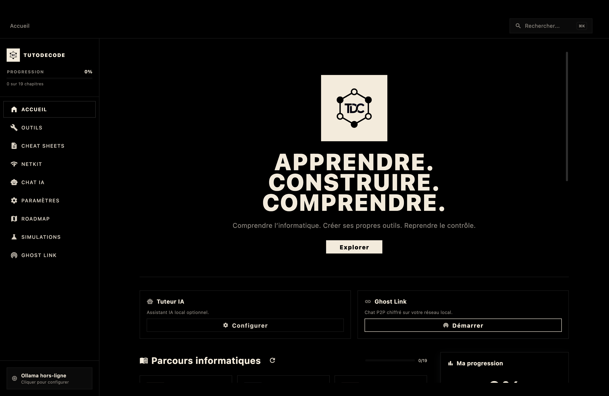
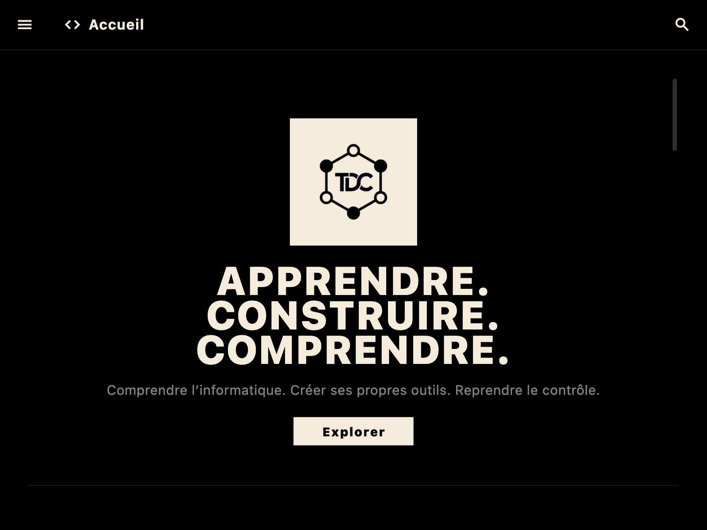
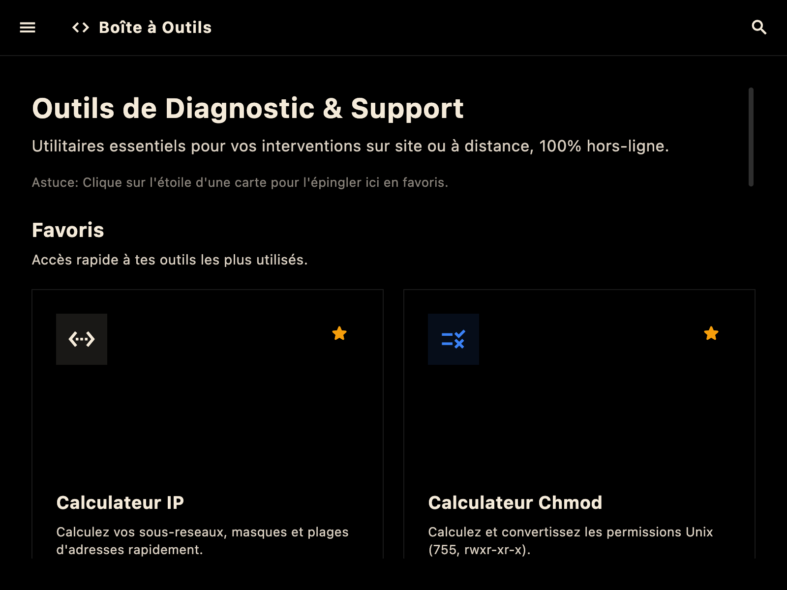
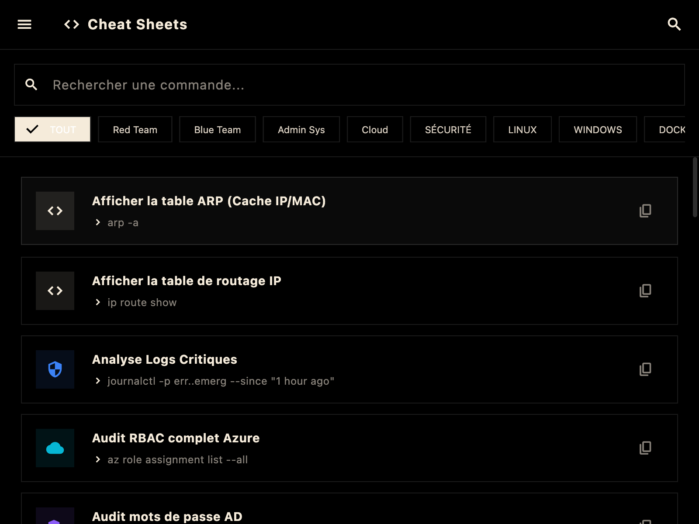
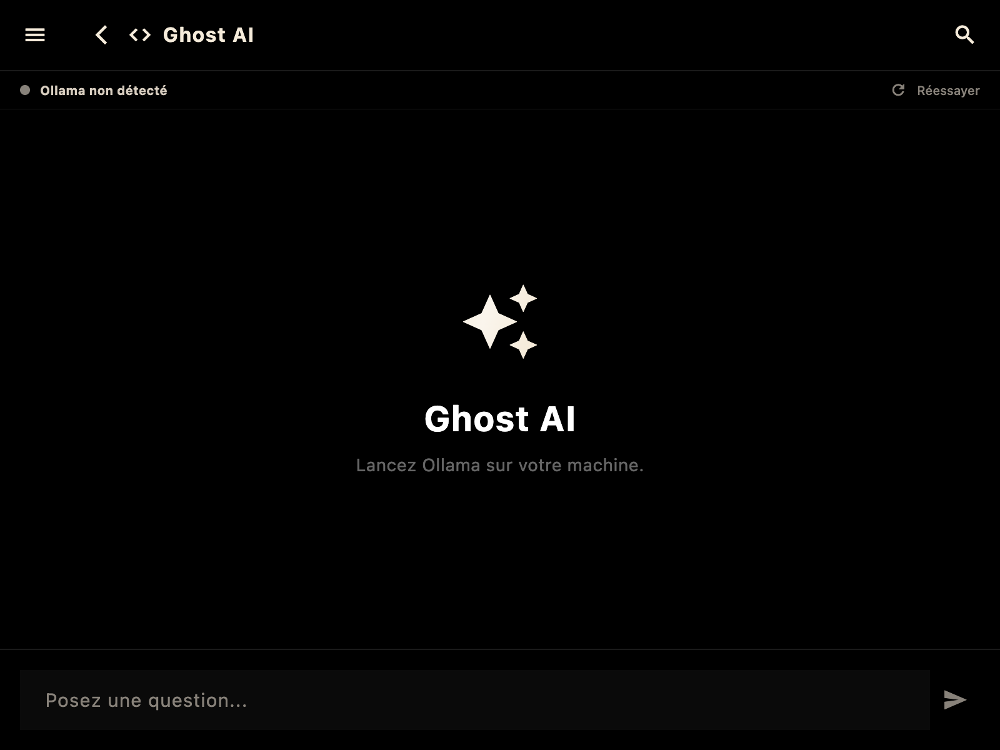
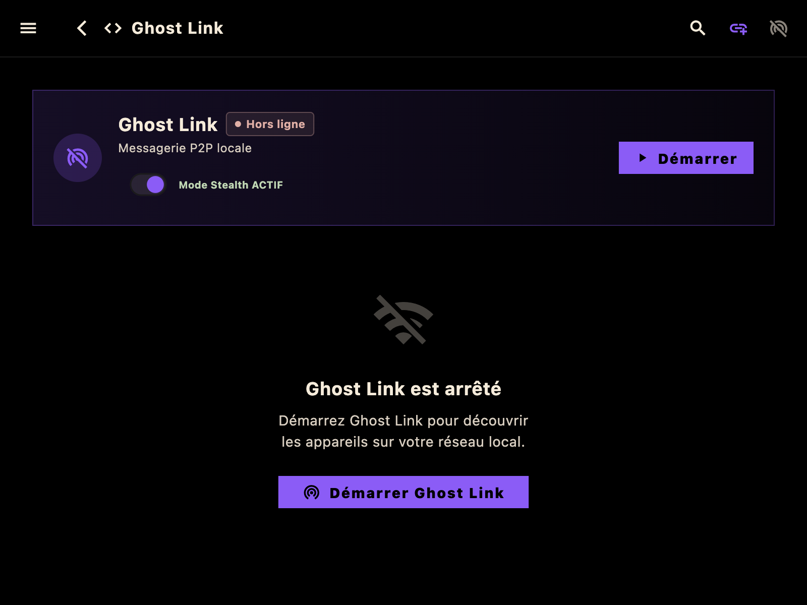
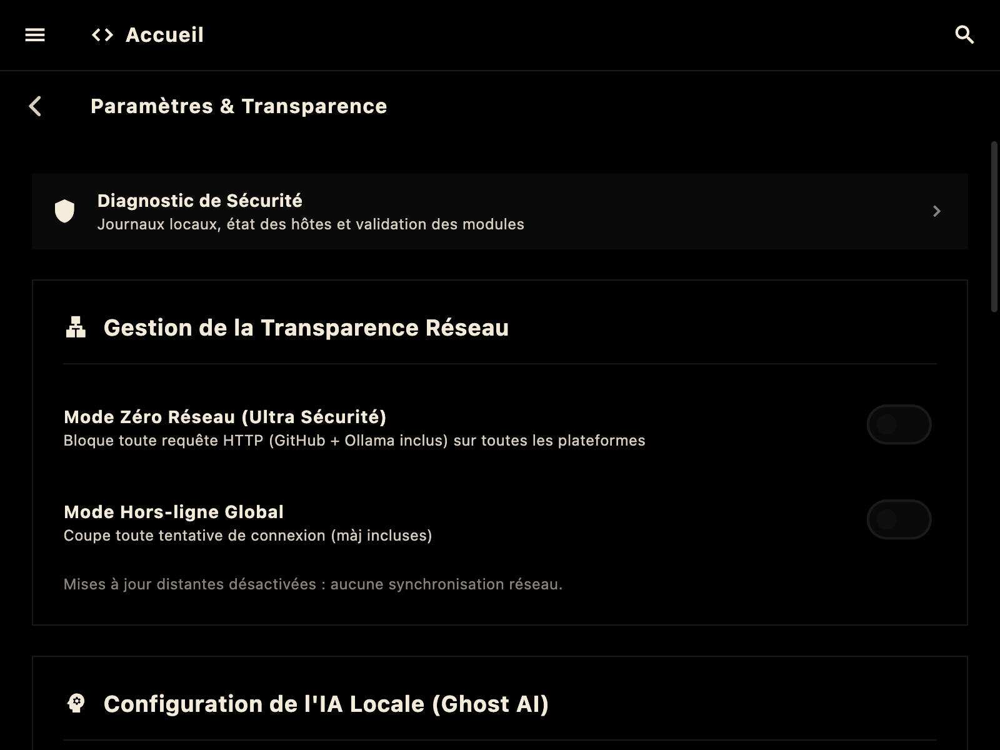
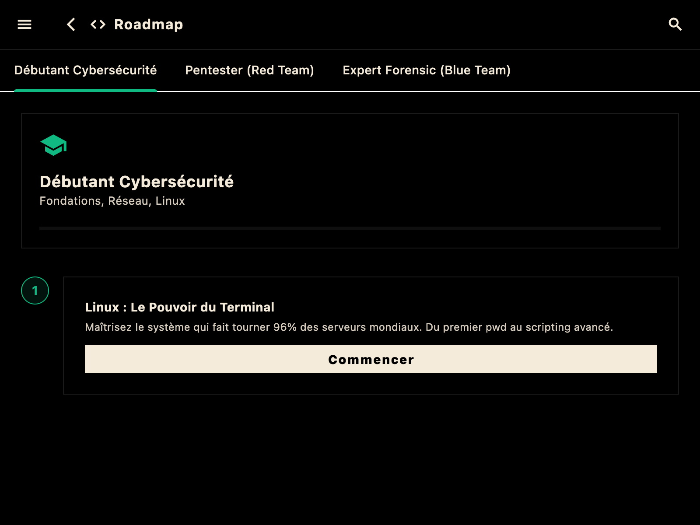

<div align="center">
  

  # T2DECODE
  
  **Le savoir technique ne devrait jamais dépendre d'une connexion.**

  [](https://github.com/TUTODECODE-FR/T2DECODE/actions/workflows/ci.yml)
  [](https://github.com/TUTODECODE-FR/T2DECODE/releases/latest)
  [](https://github.com/TUTODECODE-FR/T2DECODE/blob/main/LICENSE)
  [](https://flutter.dev)
  [](RGPD.md)
  
  <br>
  <p>
    <b>Plateforme locale d’apprentissage technique (réseau · systèmes · sécurité défensive) avec outils utilitaires intégrés.</b><br>
    <i>Offline‑first · Air‑gapped ready · Zéro tracking · IA locale (Ollama)</i>
  </p>
  <br>

  [Releases](https://github.com/TUTODECODE-FR/T2DECODE/releases/latest) · [Build](docs/build.md) · [Architecture](docs/architecture.md) · [Confidentialité & RGPD](RGPD.md) · [Contribution](CONTRIBUTING.md)
</div>

---

## 🎯 À quoi sert T2DECODE ?

T2DECODE est une **suite pédagogique et pratique** pour apprendre et expérimenter **sans dépendre d’un cloud** :

- 📚 **Apprendre** : Cours interactifs, cheat sheets, parcours structurés (Markdown/JSON).
- 🛠️ **Pratiquer** : Outils utilitaires (diagnostic, conversions, références), simulateurs/labs virtuels.
- 🛡️ **Travailler en environnement contraint** : Parfait pour le mode offline-first, les systèmes air-gapped, sans aucune télémétrie.

### Nos Engagements (Privacy by Design)

T2DECODE est conçu pour un usage **éducatif et défensif** (apprentissage, diagnostic, hygiène, durcissement). 

| Ce que nous faisons ✅ | Ce que nous ne faisons PAS ❌ |
| :--- | :--- |
| Exécution 100% Locale | Pas d’API externe obligatoire |
| Respect de la vie privée ([RGPD](RGPD.md)) | Pas d’analytics / trackers |
| Modèle de sécurité robuste | Pas d’envoi de données vers des tiers |

---

## 👥 Pour qui ?

- 🎓 **Étudiants & Autodidactes** : IT & sécurité informatique.
- 🧑‍💻 **Admins Système / Réseau** : Checklists, outils offline.
- 🕵️ **Auditeurs & Experts Sécurité** : Interventions en environnement restreint (zones blanches, datacenters, air‑gapped).
- 👨‍🏫 **Formateurs** : Support local, reproductible, auditabilité.

---

## ⚡ Fonctionnalités Phares

| Fonctionnalité | Description | Document |
| :--- | :--- | :--- |
| 🧠 **IA Locale** | Intégration Ollama sans service tiers pour une assistance LLM hors ligne. | [docs/ollama.md](docs/ollama.md) |
| 🔬 **Laboratoires** | Simulateurs (Réseau, Sécurité, Système, Cloud, Crypto, etc.). | [docs/labs.md](docs/labs.md) |
| 🛠️ **Multi-Outils** | +15 Outils utilitaires offline (Hash, CIDR, Chmod, CRON, Ports, etc.). | [docs/tools.md](docs/tools.md) |
| 📚 **Modules** | Support de contenus riches Markdown/JSON. | [docs/modules.md](docs/modules.md) |
| 🔒 **Sécurité** | Anti-tampering, vérification d'intégrité (SHA-256), isolation. | [docs/security-model.md](docs/security-model.md) |

---

## 📥 Téléchargements & Plateformes

➡️ [**Télécharger la dernière version (Releases)**](https://github.com/TUTODECODE-FR/T2DECODE/releases/latest)

| Plateforme | Fichier recommandé | CI | Distribution |
| :--- | :--- | :---: | :---: |
|  | **APK** / AAB | Actif | Disponible (v1.0.1) |
|  | **ZIP** / EXE | Actif | Disponible (v1.0.1) |
|  | **PKG** / ZIP | Actif | Disponible (v1.0.1) |
|  | **AppImage** / DEB | Actif | Disponible (v1.0.1) |

> **Vérification d'intégrité** : Un fichier `SHA256SUMS.txt` est publié dans chaque release pour vérifier l'intégrité des binaires. Des signatures `.sig` Linux sont également publiées.

---

## 🖼️ Aperçu de l'Interface

Voici quelques captures d'écran de l'application (build macOS v1.0.1) :

<div align="center">
  
  <br><br>
  
  
  <br><br>
  
  
  <br><br>
  
  
  <br><br>
  
</div>

---

## 👨‍💻 Développement & Compilation

### 1. Prérequis Système (OS Dependencies)

Avant de cloner ou de compiler, installez les dépendances natives requises :

- **Linux (Debian/Ubuntu)** :
  ```bash
  sudo apt-get update && sudo apt-get install -y clang cmake git ninja-build pkg-config libgtk-3-dev liblzma-dev libstdc++-12-dev
  ```
- **macOS** : `xcode-select --install`
- **Windows** : Installer **Git** et **Visual Studio 2022** (avec "Développement Desktop en C++").

> ℹ️ *Pour plus de détails, consultez le fichier **[OS_DEPENDENCIES.md](OS_DEPENDENCIES.md)**.*

### 2. Démarrage rapide

```bash
git clone https://github.com/TUTODECODE-FR/T2DECODE.git
cd T2DECODE
make setup
make get
make test
flutter run
```

### 🔧 Commandes utiles (Makefile)

```bash
make setup          # Vérifie l’environnement (Flutter, Dart, Ollama)
make clean          # Nettoie les artefacts
make build-android  # Build APK release
make build-macos    # Build macOS app
make build-linux    # Build Linux binary
make build-dmg      # Création DMG (macOS)
```

---

## 🤝 Contribuer

T2DECODE est un projet open source. Les contributions sont les bienvenues ! Que ce soit pour ajouter un outil, corriger un bug, ou créer un nouveau module de cours.

Veuillez consulter le fichier [CONTRIBUTING.md](CONTRIBUTING.md) pour les détails.
- ⭐️ Mettez une étoile sur le repo GitHub
- 🐛 Signalez les bugs
- 📝 Proposez des modules (Markdown/JSON)

---

## 🏛️ L'Association TUTODECODE

Le projet est fièrement porté par l'**Association TUTODECODE** (ESS).  
Notre objectif est de rendre l'apprentissage technique accessible sans dépendance au cloud, en favorisant des outils libres, locaux et auditables. Projet à but non lucratif orienté partage de connaissances techniques et sécurité informatique accessible.

- **SIREN** : 102 763 133  
- **Site** : [https://tutodecode.org](https://tutodecode.org)
- **Politique RGPD** : [Consulter ici](RGPD.md)

---

## 📄 Licence

Ce projet est sous licence **[GPLv3](LICENSE)**.  
Merci à toutes celles et ceux qui prennent le temps de tester, contribuer ou partager le projet ! 🌟
