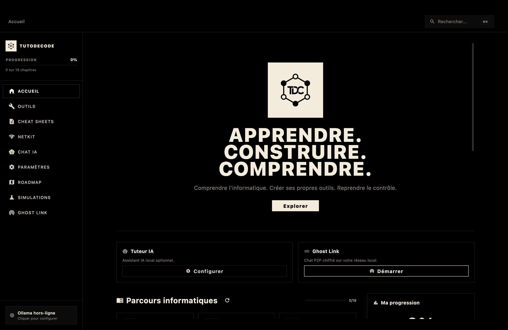
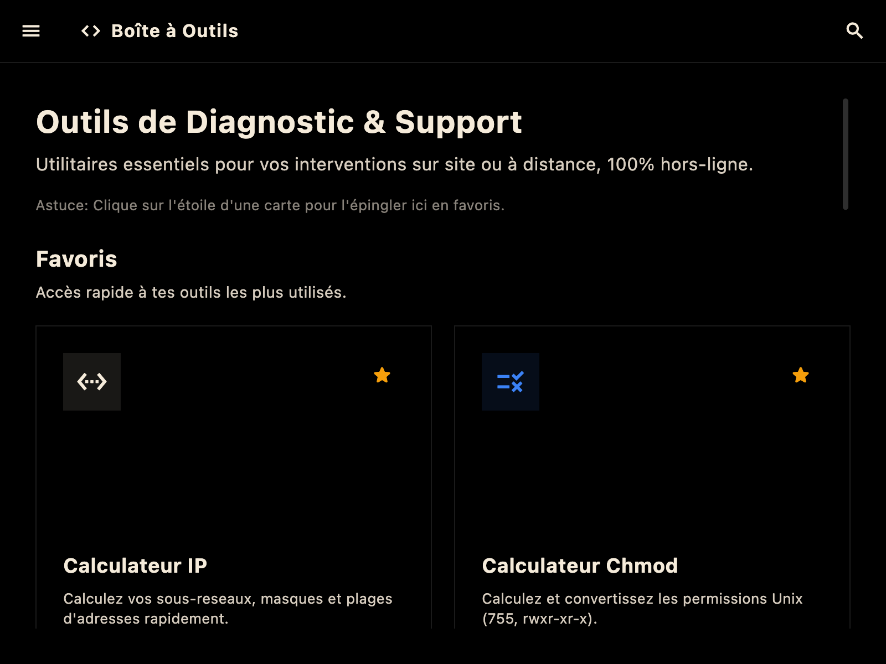
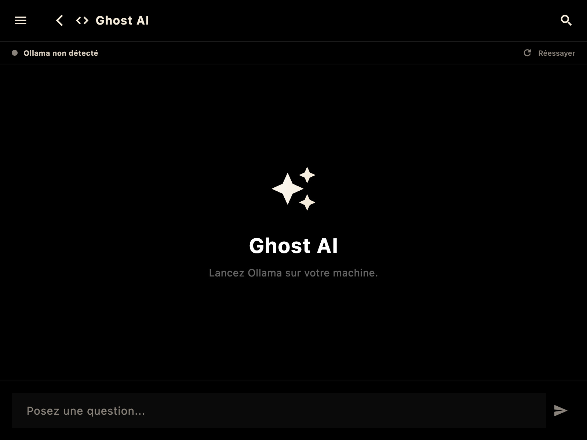
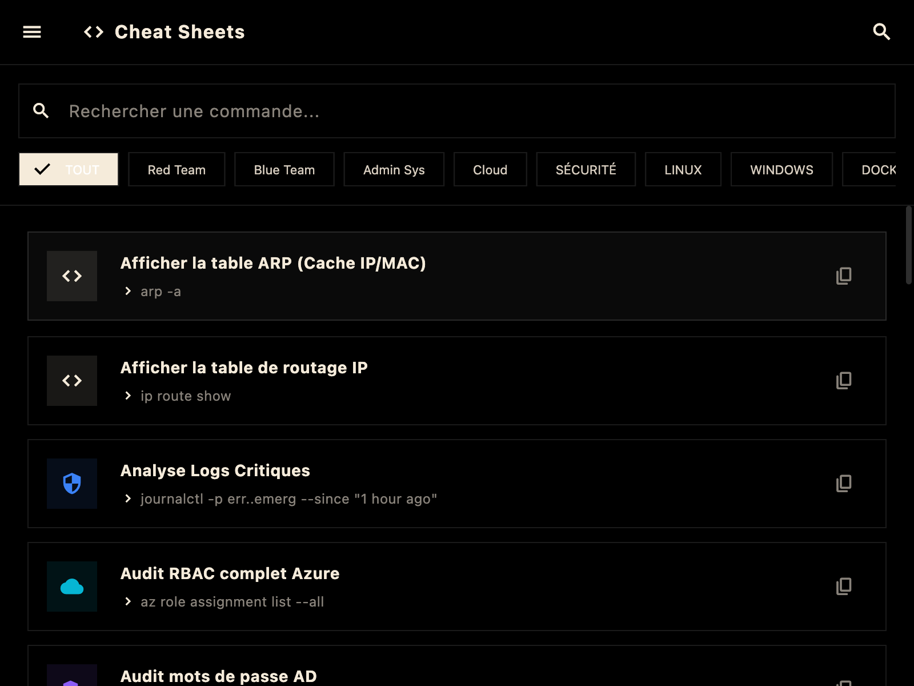

<meta name="fediverse:creator" content="@TUTODECODE@mastodon.social">

<div align="center">
  <p>
    <strong>🇫🇷 Français</strong> | <a href="README_EN.md">🇬🇧 English</a>
  </p>
  <a href="https://tutodecode.org">
    
  </a>

  <h1>T2DECODE</h1>
  <p><strong>Plateforme pédagogique autonome et souveraine pour les réseaux, la cybersécurité et l'administration système.</strong><br>
  <em>100% Hors-Ligne · Zéro Cloud · Zéro Tracking · Licence Libre GPLv3</em></p>

  <p align="center">
    
    
    
    
    
    
  </p>
  <p align="center">
    
    
    
  </p>
  <p align="center">
    
    
    
    
  </p>

  <p>
    <a href="#-téléchargement--installation-prêt-à-lemploi">Télécharger</a> · 
    <a href="#-présentation--modules">Présentation</a> · 
    <a href="#-assurance-qualité--transparence">Qualité & Sécurité</a> · 
    <a href="#-rejoindre-léquipe--contribuer">Contribuer</a> · 
    <a href="#-compilation-depuis-les-sources-développeurs">Compiler</a> · 
    <a href="docs/architecture.md">Architecture</a>
  </p>
</div>


## 📑 Sommaire

<details>
<summary><strong>Cliquez ici pour dérouler le sommaire complet</strong></summary>

- [📦 Téléchargement & Installation](#-téléchargement--installation-prêt-à-lemploi)
  - [Linux (Snap Store)](#-installation-linux-snap-store)
  - [macOS (Homebrew)](#-installation-macos-homebrew)
  - [Windows](#-lancement-windows-smartscreen)
  - [Android (F-Droid)](#-installation-android-f-droid)
- [🛠️ Présentation & Modules](#️-présentation--modules)
- [🛡️ Assurance Qualité & Transparence](#-assurance-qualité--transparence)
- [🤝 Rejoindre l'Équipe & Contribuer](#-rejoindre-léquipe--contribuer)
- [🗺️ Roadmap & Prochaines Évolutions](#️-roadmap--prochaines-évolutions)
- [🛡️ Vérification d'Intégrité (Zero Trust)](#️-vérification-dintégrité--sécurité-zero-trust)
- [💻 Compilation depuis les Sources](#-compilation-depuis-les-sources-développeurs)
- [❓ Foire Aux Questions (FAQ)](#-foire-aux-questions-faq)
- [📚 Documentation Complète](#-documentation-complète)
- [⚖️ Mentions Légales & Licence](#️-mentions-légales--licence)

</details>

---

## 📦 Téléchargement & Installation (Prêt à l'Emploi)

Les binaires pré-compilés et authentifiés sont distribués gratuitement sur nos canaux officiels :

| Plateforme | Canal de Distribution | Format | Commande / Méthode |
| :--- | :--- | :--- | :--- |
| **Linux** | [Snap Store](https://snapcraft.io/t2decode) / [Releases GitLab](https://gitlab.com/tutodecode-org/T2DECODE/-/releases) | Snap / AppImage / DEB | `sudo snap install t2decode` |
| **macOS** | [App Store](https://apps.apple.com/us/app/t2decode-plateforme/id6762523276?mt=12) / **Homebrew** / [Releases](https://gitlab.com/tutodecode-org/T2DECODE/-/releases) | PKG / DMG / Cask | `brew install --cask t2decode` |
| **Android** | [F-Droid](https://f-droid.org/packages/org.t2decode.app/) / [Releases](https://gitlab.com/tutodecode-org/T2DECODE/-/releases) | APK / AAB | *Via F-Droid Client* |
| **Windows** | [Releases GitLab](https://gitlab.com/tutodecode-org/T2DECODE/-/releases) / [SourceForge](https://sourceforge.net/projects/t2decode/) | EXE / ZIP | *Téléchargement direct* |

> 🌐 **Miroir d'audit & distribution tiers** : L'intégralité des binaires et fichiers de checksums est également disponible sur notre [Miroir officiel SourceForge](https://sourceforge.net/projects/t2decode/).

---

### 🐧 Installation Linux (Snap Store)
[](https://snapcraft.io/t2decode)
```bash
sudo snap install t2decode
```

### 🍏 Installation macOS (Homebrew)
```bash
brew tap tutodecode-org/homebrew-tap
brew install --cask t2decode
```
> 💡 **Première ouverture sur macOS (Gatekeeper)** : Si un message "Développeur non vérifié" apparaît au premier lancement du binaire `.dmg` : faites un **Clic Droit sur T2DECODE.app → Ouvrir**, ou exécutez `xattr -cr /Applications/T2DECODE.app` dans le Terminal.

### 🪟 Lancement Windows (SmartScreen)
> 💡 **Première ouverture sur Windows (SmartScreen)** : Si la fenêtre de protection bleue Windows s'affiche au premier lancement de l'exécutable `.exe` : cliquez sur **"Informations complémentaires"** puis sur le bouton **"Exécuter quand même"**. L'application `Association TUTODECODE` sera mémorisée pour les lancements suivants.


## 🛠️ Présentation & Modules

**T2DECODE** est un environnement d'apprentissage et d'expérimentation technique conçu pour fonctionner en **mode strictement autonome et hors-ligne (Air-gapped)**. Aucune donnée ne quitte votre ordinateur : zéro télémétrie, zéro tracking, zéro cloud tiers.

### 🧰 Les 6 Modules Clés Intégrés

| Module | Description & Usage Technique |
| :--- | :--- |
| **🧠 Ghost AI (LLM Local)** | Assistant IA local (Ollama) exploitant un pipeline RAG basé sur les cours intégrés. |
| **🌐 NetKit (Réseaux)** | Modélisation et simulation dynamique de topologies réseau (adressage IPv4/v6, routage). |
| **💻 Linux VM Sandbox** | Terminal virtuel POSIX sécurisé pour s'entraîner aux commandes et au bash. |
| **🔐 CryptoLab** | Expérimentation interactive des algorithmes cryptographiques (RSA, AES, SHA-256). |
| **🛠️ Outils Métier** | Calculateur CIDR IPv4/v6, convertisseur Chmod, générateur CRON, vérificateur d'empreintes. |
| **📚 Cours Masterclass** | Guides d'ingénierie rédigés avec cas d'incidents réels, réflexes de production et QCM. |

### Interface

<p align="center">
  
  
</p>
<p align="center">
  
  
</p>


## 🛡️ Assurance Qualité & Transparence

T2DECODE s'appuie sur une ingénierie de sécurité rigoureuse et automatisée :

- **163 Tests Automatisés** : Tests unitaires et d'interface utilisateur validés à 100% sur chaque modification.
- **Audit de Couverture (`verify_coverage.py`)** : Contrôle continu du taux de couverture des tests.
- **16 Scanners CI/CD DevSecOps** :
  - `Gitleaks` : Scan d'historique Git contre les fuites de clés.
  - `Semgrep SAST` : Audit de sécurité du code source.
  - `Google OSV-Scanner` & `Trivy` : Audit des vulnérabilités de dépendances Supply Chain.
  - `ClamAV` : Scan antivirus et anti-malware.
  - `flutter analyze`, `yamllint`, `shellcheck` : Linters de qualité et de conformité.
- **Conformité OWASP MASVS** : Cartographie d'intégrité documentée dans [`docs/masvs-mapping.md`](docs/masvs-mapping.md).


## 🤝 Rejoindre l'Équipe & Contribuer

L'**Association TUTODECODE** accueille les contributeurs et développeurs passionnés par les réseaux et la cybersécurité !

- 📖 **Guide de contribution** : Consultez [`CONTRIBUTING.md`](CONTRIBUTING.md) pour les détails.
- 👥 **Recrutement mainteneurs** : Voir les opportunités dans [`MAINTAINERS.md`](MAINTAINERS.md).
- 💬 **Support & Échanges** : Contactez l'équipe sur `contact@tutodecode.org`.


## 🗺️ Roadmap & Prochaines Évolutions

- [x] Publication multiplateforme (Snap Store, Homebrew, F-Droid, App Store)
- [x] Pipeline DevSecOps complet (16 scanners automatisés)
- [x] Intégrité binaire et audit OWASP MASVS
- [ ] T2C-Phantom : Module de synchronisation P2P décentralisée LAN
- [ ] Extension des simulateurs Réseau & Analyse de paquets


## 🛡️ Vérification d'Intégrité & Sécurité (Zero Trust)

*Contrôlez toujours l'empreinte numérique SHA-256 de vos exécutables avant de les lancer.*

Comparez le résultat avec les sommes officielles publiées sur [GitLab Releases](https://gitlab.com/tutodecode-org/T2DECODE/-/releases) ou [SourceForge](https://sourceforge.net/projects/t2decode/).

#### 🐧 Linux & 🍏 macOS (Terminal)
```bash
sha256sum T2DECODE-Linux.tar.gz
shasum -a 256 T2DECODE-macOS.dmg
```

#### 🪟 Windows (PowerShell)
```powershell
Get-FileHash .\T2DECODE-Windows.zip -Algorithm SHA256
```


## 💻 Compilation depuis les Sources (Développeurs)

#### Prérequis Système
- **Flutter SDK** : Version `stable` (3.x+)
- **Linux (Debian/Ubuntu)** : `sudo apt-get install clang cmake ninja-build pkg-config libgtk-3-dev liblzma-dev`
- **macOS** : Xcode Command Line Tools (`xcode-select --install`)
- **Windows** : Visual Studio 2022 (*Desktop C++* et composant *ATL*)

#### Initialisation et Lancement

```bash
git clone https://gitlab.com/tutodecode-org/T2DECODE.git
cd T2DECODE

make setup
make get
make test
flutter run
```

#### Génération des Binaires Release via `Makefile`
```bash
make build-android  # Génère les APKs Release (per-ABI)
make build-linux    # Compile le binaire Linux natif
make build-macos    # Compile l'exécutable macOS .app
make build-dmg      # Génère le paquet d'installation DMG (macOS)
```


## ❓ Foire Aux Questions (FAQ)

### 1. L'application fonctionne-t-elle vraiment 100% hors-ligne ?
Oui, l'application est conçue selon le principe Air-gapped : zéro télémétrie, zéro serveur cloud distant. Ollama (Ghost AI) s'exécute localement sur votre machine.

### 2. Comment signaler un bug de sécurité en toute confidentialité ?
N'ouvrez pas d'issue publique. Envoyez un rapport directement à `contact@tutodecode.org`. Consultez notre politique complète dans [`SECURITY.md`](SECURITY.md).

### 3. Quel est le statut de la licence du code source ?
T2DECODE est diffusé sous licence libre **GNU General Public License v3.0 (GPLv3)**.


## 📜 Langage de Cours TUTODECODE Script (`.tdc`)

T2DECODE intègre un **langage dédié souverain et lisible par un humain (`.tdc`)** pour concevoir des cours, des ateliers pratiques et des QCM interactifs sans la verbosité du JSON.

### 🌟 Avantages du format `.tdc` :
- **Lisibilité optimale** : Aucun guillemet inutile sur les clés de configuration.
- **Blocs Markdown natifs** : Délimités par `"""` pour rédiger du contenu riche sans échapper les sauts de ligne.
- **QCM Express** : Marqueur `+` pour la bonne réponse, `-` pour les leurres.
- **Parser embarqué** : Compilé en objets Dart natifs via `TDCParser` ([`lib/core/parser/tdc_parser.dart`](lib/core/parser/tdc_parser.dart)).

---

### 📝 Structure d'un fichier `.tdc` :

```tdc
course "linux-basics" {
  title: "Linux : Le Pouvoir du Terminal"
  description: "Maîtrisez le système qui fait tourner 96% des serveurs."
  category: linux
  level: beginner
  duration: 6h
  icon: Terminal
  keywords: [linux, bash, terminal, sysadmin]

  module "intro" {
    title: "Architecture et Commandes Essentielles"
    duration: 15min

    content """
    # 🚨 Incident de Prod #01 : Diagnostic d'Urgence à 3h du Matin

    Vous êtes connecté en SSH sur un serveur de production qui ne répond plus.
    Utilisez les commandes de base pour auditer la machine en moins de 60s.
    """

    codeblock "bash" {
      title: "Kit d'audit immédiat"
      code """
      whoami       # Quel utilisateur suis-je ?
      pwd          # Où suis-je ?
      uptime       # Charge processeur
      """
    }

    quiz {
      question "Quelle commande affiche la charge du processeur ?" {
        - "whoami"
        + "uptime"
        - "pwd"
        explanation "uptime donne le load average à 1, 5 et 15 minutes."
      }
    }
  }
}
```

---


## 📚 Documentation Complète

- [🏗️ Architecture technique](docs/architecture.md)
- [🔒 Politique de sécurité](SECURITY.md)
- [🛡️ Cartographie OWASP MASVS](docs/masvs-mapping.md)
- [🤝 Guide de contribution](CONTRIBUTING.md)
- [👥 Recrutement mainteneurs](MAINTAINERS.md)
- [📄 Licence GPLv3](LICENSE)


## ⚖️ Mentions Légales & Licence

Le projet T2DECODE est développé et édité par l'**Association TUTODECODE** (Association Loi 1901 à but non lucratif, SIREN 102 763 133, RNA W134011400).

- **Fondateur & Président** : Maxime MARTIN CIVET
- **Site Officiel** : [tutodecode.org](https://tutodecode.org)
- **Licence** : [GNU General Public License v3.0 (GPLv3)](LICENSE) — Logiciel Libre et Souverain.

---

<div align="center">

**T2DECODE** — Plateforme pédagogique autonome et souveraine pour les réseaux et la cybersécurité

Édité par l'Association TUTODECODE (Loi 1901, SIREN 102 763 133)

[Site Web](https://tutodecode.org) · [GitLab](https://gitlab.com/tutodecode-org/T2DECODE) · [SourceForge](https://sourceforge.net/projects/t2decode/) · [Contact](mailto:contact@tutodecode.org)

<sub>© 2024-2026 Association TUTODECODE. Tous droits réservés.</sub>

</div>
