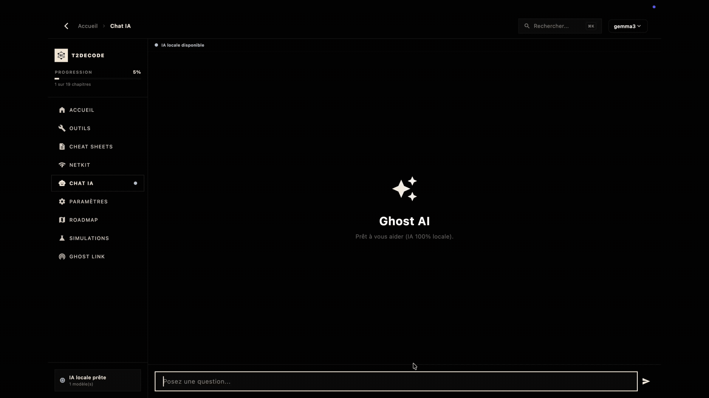

<div align="center">
  <p>
    <a href="README.md">🇫🇷 Français</a> | <strong>🇬🇧 English</strong>
  </p>

  <a href="https://gitlab.com/tutodecode-org/T2DECODE">
    
  </a>

  <h1>T2DECODE</h1>
  <p><strong>T2DECODE — Offline educational platform for networking, Linux, and cybersecurity.</strong></p>

  <p>T2DECODE is a standalone software suite for IT students, trainers, and professionals. It brings together interactive courses, technical simulators, specialized tools, and a local AI assistant (Ollama), all designed to work without an internet connection to guarantee data privacy and integrity.</p>

  <p><strong>Key Highlights:</strong></p>
  <ul>
    <li>100% offline functionality — no cloud dependencies.</li>
    <li>Interactive simulators: networking, Linux, cryptography.</li>
    <li>Integrated professional tools: CIDR, hashing, chmod, cron.</li>
    <li>Ghost AI: local LLM assistant via Ollama, with no external data transmission.</li>
    <li>Integrity and security: SHA-256 and anti-tampering checks at startup.</li>
  </ul>

  <p><strong>Multi-platform • Air-gapped ready • Open-source (GPLv3)</strong></p>

  <br>
  
  <br><br>

  <!-- CI & Distribution Badges -->
  <p>
    <a href="https://about.gitlab.com/solutions/open-source/"></a>
    <a href="https://gitlab.com/tutodecode-org/T2DECODE/-/pipelines"></a>
    <a href="https://gitlab.com/tutodecode-org/T2DECODE/-/releases"></a>
    <a href="https://apps.apple.com/us/app/t2decode-plateforme/id6762523276?mt=12"></a>
    <a href="https://gitlab.com/tutodecode-org/homebrew-tap"></a>
    <a href="https://f-droid.org/packages/org.t2decode.app/"></a>
    <a href="https://flutter.dev"></a>
    <a href="https://gitlab.com/tutodecode-org/T2DECODE/blob/main/LICENSE"></a>
  </p>

  <!-- OpenSSF Badges -->
  <p>
    <a href="https://www.bestpractices.dev/projects/12999"></a>
    <a href="https://www.bestpractices.dev/projects/12999"></a>
    <a href="https://scorecard.dev/viewer/?uri=gitlab.com/tutodecode-org/T2DECODE"></a>
  </p>

  <p>
    <a href="https://gitlab.com/tutodecode-org/T2DECODE/-/releases">Releases</a> · 
    <a href="docs/resume.md">Summary</a> ·
    <a href="docs/build.md">Build & Compilation</a> · 
    <a href="docs/architecture.md">Architecture</a> · 
    <a href="RGPD.md">Privacy Policy</a> · 
    <a href="CONTRIBUTING.md">Contributing</a>
  </p>
</div>


## 📊 By the Numbers

- 📚 **120+** educational sheets
- 🔬 **9** simulators
- 🛠️ **15+** integrated tools
- 💻 **Windows / Linux / macOS / Android**
- 🌐 **0** cloud dependencies
- 🔒 **100%** open source


## ⚙️ Features

| Module | Description |
|----------|------------|
| **Ghost AI** | Local AI assistant (Ollama LLM) with RAG on courses |
| **NetKit** | Network simulator (Topology, Routing, Ping) |
| **CryptoLab** | Cryptography simulator (Symmetric/Asymmetric encryption) |
| **LinuxLab** | Linux terminal simulator |
| **CIDR** | IPv4/IPv6 subnet calculator |
| **Hash** | Hashing utilities (SHA256, MD5, etc.) |
| **Chmod** | Linux system permissions calculator |
| **Cron** | Scheduled tasks generator and validator |
| **T2C-Phantom** | Decentralized P2P network for course updates |

### 🔄 Autonomous P2P Updates with T2C-Phantom

The **T2C-Phantom** protocol (P2P synchronization engine via Go/libp2p proxy) is currently scheduled for the next development stages (Phase 2). 

To learn more about network security, course integrity validation (SHA-256), and technical details of this implementation, please see the dedicated documentation: [Security & Integrity FAQ](docs/prochaine_mise_a_jour.md).


## 🖼️ T2DECODE in Action

<p align="center">
  
  
</p>
<p align="center">
  
  
</p>


## 🎯 Why T2DECODE?

Unlike traditional training platforms:

| Cloud Platforms | T2DECODE |
|------------------|-----------|
| Internet required | Works **offline** |
| Data hosted by a third party | **Local** data |
| Remote AI (SaaS) | **Local** Ollama AI |
| Barely usable in secure environments | **Air-Gapped Ready** |
| Requires a subscription | **Standalone** software |


## 👨‍💻 Use Cases

**🎓 For Students**
- Review networking concepts (OSI, TCP/IP) without an Internet connection.
- Perform practical exercises on simulators (NetKit, Linux).

**🛠️ For System Administrators**
- Quickly use IPv4/v6 CIDR calculators.
- Verify Linux permissions (chmod) or generate CRON requests from a clean interface.

**👨‍🏫 For Trainers**
- Distribute complete course materials on USB flash drives (Air-gapped).
- Build and provide standalone virtual pedagogical labs.


## 🗺️ Visual Roadmap

We are building the future of sovereign education:

- [x] Interactive simulators
- [x] Local AI (Ollama)
- [x] Offline toolkit
- [ ] Synchronization engine (T2C-Phantom)
- [ ] Local P2P messaging (Ghost Link)
- [ ] Community educational modules marketplace


## 🚀 Quick Start (Users)

If you don't want to compile the application yourself, here are the three steps to get started in a flash:

1. **📥 Download**: Grab the [latest release](https://gitlab.com/tutodecode-org/T2DECODE/-/releases) for your system (Windows, macOS, Linux, Android).
2. **⚡ Launch**: The application is standalone, install it or run the binary directly depending on your platform.
3. **🎓 Use**: You're done! You can instantly use the toolkit, play with simulators, and chat with the local AI (Ollama).


## 🏗️ Visual Architecture

T2DECODE is structured in a modular way, separating the interface from the underlying local services.

```text
User
   │
   ▼
T2DECODE (Flutter Application)
 ├── 📚 Courses (Markdown, MCQs, Local progression)
 ├── 🔬 Simulators (Networking, Crypto, System)
 ├── 🛠️ Tools (Hash, CIDR, Chmod, CRON...)
 ├── 🧠 Ghost AI (HTTP client to local Ollama)
 └── 🔗 Ghost Link (LAN P2P Service - WIP)
```


## 📥 Downloads & Platforms

➡️ [**Download pre-compiled binaries (GitLab Releases)**](https://gitlab.com/tutodecode-org/T2DECODE/-/releases)

| Platform | Distribution Format | CI Status | Accessibility |
| :--- | :--- | :---: | :---: |
|  | **APK** / AAB (64-bit) | Active | Available |
|  | **ZIP** / EXE Installer | Active | Available |
|  | **[App Store](https://apps.apple.com/us/app/t2decode-plateforme/id6762523276?mt=12)** / **Homebrew Cask** / PKG / DMG | Active | Available |
|  | **AppImage** / DEB (64-bit) | Active | Available |

### 🍺 Quick Install via Homebrew (macOS)

You can easily install and maintain **T2DECODE** updated via Homebrew:

```bash
# 1. Add official TUTODECODE tap
brew tap tutodecode-org/homebrew-tap

# 2. Trust the tap (required once on your Mac)
brew trust tutodecode-org/tap

# 3. Install T2DECODE
brew install --cask t2decode
```

> 💡 **Easy Update**: To update T2DECODE later to the latest version, simply run `brew upgrade --cask t2decode`.

> 🔒 **Integrity Guarantee**: Each version comes with a `SHA256SUMS.txt` file and cryptographic signatures to authenticate the origin of the binaries.


## 🛡️ Security Posture & Continuous Audits

Security is at the heart of T2DECODE's architecture. We apply rigorous development standards to aim for a high level of reliability.

### 1. CI/CD Security (Automated Pipelines)
- **Static Analysis (SAST)**: SonarQube and CodeQL run on each Pull Request to guarantee code reliability.
- **Vulnerability Scanning**: Google OSV-Scanner continuously audits dependencies (`osv-scanner.yml`).
- **Automated Pentesting**: MobSF performs dynamic analysis of the generated Android APK (`mobsf.yml`).
- **OpenSSF Scorecard**: Continuous audit of Open Source security best practices.

### 2. Runtime Security (In-App)
Our architecture is implemented in native Dart directly in [`lib/core/security/`](lib/core/security/).
- **Active Anti-Tampering**: On startup, the system recalculates SHA-256 hashes of all assets via `assets/asset_checksums.json`. Any malicious modification is detected.
- **Authenticity & Certificates**: Strict verification of stored signatures in an encrypted manner.
- **Air-Gapped Design**: No telemetry, no tracking SDKs, no cloud API calls.


## 👨‍💻 Development Environment & Compilation

### 1. Required System Dependencies

The application relies on Flutter and native libraries. Make sure to install the prerequisites according to your system:

- **Linux (Debian / Ubuntu)**:
  ```bash
  sudo apt-get update && sudo apt-get install -y clang cmake git ninja-build pkg-config libgtk-3-dev liblzma-dev libstdc++-12-dev
  ```
- **macOS**: `xcode-select --install`
- **Windows**: Git and Visual Studio 2022 with the *Desktop development with C++* workload.

> 📖 *For detailed instructions per distribution, check [OS_DEPENDENCIES.md](OS_DEPENDENCIES.md).*

### 2. Quick Start

```bash
# Clone the official repository
git clone https://gitlab.com/tutodecode-org/T2DECODE.git
cd T2DECODE

# Check build environment
make setup

# Install Flutter dependencies
make get

# Run the automated test suite
make test

# Launch the application in debug mode
flutter run
```

### 🛠️ Task Automation (Makefile)

The project includes a comprehensive `Makefile` to facilitate compilation across all targets:

```bash
make setup          # Dependency diagnostics (Flutter, Dart, Ollama)
make clean          # Complete cleanup of build directories
make test           # Run automated tests
make build-android  # Build release APK archive
make build-macos    # Build macOS .app binary
make build-dmg      # Create macOS installation disk image (.dmg)
make build-linux    # Build native Linux executable
```


## 🏛️ TUTODECODE Association (Legal Notice)

The T2DECODE project is developed and supported by the **TUTODECODE Association**, an entity under the Social and Solidarity Economy (ESS).  
Our mission is to democratize the mastery of IT infrastructure and cybersecurity by providing sovereign and privacy-respecting tools.

- **Publisher**: Association Loi 1901 TUTODECODE
- **Publication Director**: Maxime MARTIN CIVET
- **SIREN**: 102 763 133
- **Official Website**: [https://tutodecode.org](https://tutodecode.org)
- **Legal Proof**: [Creation announcement published in JOAFE](https://www.journal-officiel.gouv.fr/pages/associations-detail-annonce/?q.id=id:202600110336)
- **Privacy Commitment**: [Read our GDPR Policy](RGPD.md)


## 🤝 Contributing & Community Standards

T2DECODE is an open-source public good built by and for its community. All contributions are warmly welcomed!

### 📜 Standards and Project Health
- 🛡️ **[Security & Vulnerabilities](SECURITY.md)**: Our strict vulnerability management policy.
- ⚖️ **[Free License](LICENSE)**: Your rights and obligations (GPLv3).
- 🤝 **[Code of Conduct](CODE_OF_CONDUCT.md)**: For a healthy and inclusive environment.
- 📖 **[Contributing Guide](CONTRIBUTING.md)**: How to add courses or code.
- 🏛️ **[Governance](GOVERNANCE.md)**: The association's decision-making model.
- 🆘 **[Support](SUPPORT.md)**: Where to find help if needed.
- 🗺️ **[Roadmap](ROADMAP.md)**: Our next steps and targeted mission offers.

### 💖 Financial Support (Donations)
If T2DECODE saves you time or enriches your journey, you can support the TUTODECODE association. Donations are used exclusively to sustain the hosting of our services.
- ➡️ **[Make a secure donation via HelloAsso](https://www.helloasso.com/associations/tutodecode)**


## 🔐 Security
All commits in this repository are GPG-signed to guarantee their authenticity.


## 📄 License & Rights
This project is distributed under the **[GNU General Public License v3.0 (GPLv3)](LICENSE)**.
